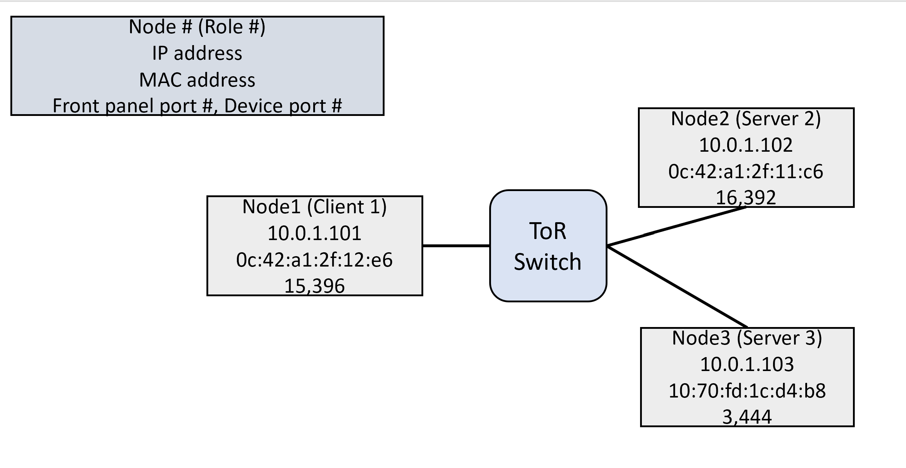

# Overview
This is the artifact that is used to evaluate NetClone, as described in the paper "NetClone: Fast, Scalable, and Dynamic Request Cloning for Microsecond-Scale RPCs" in ACM SIGCOMM 2023.
NetClone is an in-network dynamic request cloning mechanism for microsecond-scale workloads. With Netclone, the switch dynamically duplicates requests to two idle servers and returns only a faster response to the client.
With this, the client can enjoy low tail latency even if there is unexpected latency variability in servers. 

# Contents

This repository contains the following code segments:

1. Switch data plane code
2. Switch control plane code
3. Client and server applications with synthetic RPC workloads.

# Contents

# Hardware dependencies

- To run experiments using the artifact, at least 3 nodes (1 client and 2 servers) are required. However, it is recommended to use more nodes because the benefit may not be much in a small cluster. 
- Nodes should be equipped with an Nvidia ConnectX-5 NIC or similar NIC supporting Nvidia VMA for kernel-bypass networking. Experiments can still be run without the VMA-capable NICs, but this may result in increased latency and decreased throughput due to the application's reliance on a legacy network stack. 
- A programmable switch with Intel Tofino1 ASIC is needed.

Our artifact for a minimal example is tested on:
- 3 nodes (1 client and 2 servers) with single-port Nvidia 100GbE MCX515A-CCAT ConnectX-5 NIC
- APS BF6064XT switch with Intel Tofino1 ASIC

# Software dependencies
Our artifact is tested on:

**Clients and servers:**
- Ubuntu 20.04 LTS with Linux kernel 5.15.
- Mellanox OFED drivers for NICs. The version is 5.8-1.2.1 LTS.
- gcc 9.4.0
- libvma 9.4.0 for VMA

**Switch:**
- Ubuntu 20.04 LTS with Linux kernel 5.4.
- python 3.8.10
- Intel P4 Studio SDE 9.7.0 and BSP 9.7.0. 

# Minimal Testbed illustration example (1 client + 2 servers)



# Installation

## Client/Server-side
1. Place `client.c`, `server.c`, `header.h`, and `Makefile` in the home directory (We used `/home/netclone` in the paper).
2. Configure cluster-related details in `header.h`, such as IP and MAC addresses. Note that IP configuration is important in this artifact. Each node should have a linearly-increasing IP address. For example, we use 10.0.1.101 for node1, 10.0.1.102 for node2, and 10.0.1.103 for node3. This is because the server program automatically assigns the server ID based on the last digit of the IP address.

   `header.h`
   
   - Line 4 `char *interface` // Interface name.
   - Line 5 `NUM_CLI` // Number of clients. Need to assign server ID automatically. Also need for LAEDGE.
   - Line 6 `NUM_SRV_LAEDGE` // the number of servers (including LAEDGE coordinator node). Need for LAEDGE. Min. number is 3 (1 coordinator and 2 servers)
   - Line 7 `char* src_ip` // client IP addresses. Need for LAEDGE.
   - Line 8 `char* dst_ip` server IP addresses. Need for LAEDGE, NoClone, C-Clone.

3. Compile `client.c`, `server.c`, and `header.h` using `make`.

## Switch-side
1. Place `controller.py` and `netclone.p4` in the SDE directory.
2. Configure cluster-related information in the `netclone.p4`.
   - Line 2 `RECIRC_PORT` // Recirculation port number. 452 is the recirculation port for pipeline 3 in our APS BF6064XT. Check your switch spec and set it correctly. 
3. Configure cluster-related information in the `controller.py`. This includes IP and MAC addresses, and port-related information.
   - Line 2 `RECIRC_PORT` // Recirculation port number.
   - Line 3 `ip_list` // IP addresses of nodes.
   - Line 8 `port_list` // port number of nodes.
   - Line 13 `mac_list` // MAC addresses of nodes.
   - 
4. Compile `netclone.p4` using the P4 compiler (we used `p4build.sh` provided by Intel). You can compile it manually with the following commands.
   - `cmake ${SDE}/p4studio -DCMAKE_INSTALL_PREFIX=${SDE_INSTALL} -DCMAKE_MODULE_PATH=${SDE}/cmake -DP4_NAME=netclone -DP4_PATH=${SDE}/netclone.p4`
   - `make`
   - `make install`
   - `${SDE}` and `${SDE_INSTALL}` are path to the SDE. In our testbed, SDE = `/home/admin/bf-sde-9.7.0`  and SDE_INSTALL = `/home/admin/bf-sde-9.7.0/install`.
   - If done well, you should see the following outputs
   ```
   -- 
   P4_LANG: p4-16
   P4C: /home/admin/bf-sde-9.7.0/install/bin/bf-p4c
   P4C-GEN_BRFT-CONF: /home/admin/bf-sde-9.7.0/install/bin/p4c-gen-bfrt-conf
   P4C-MANIFEST-CONFIG: /home/admin/bf-sde-9.7.0/install/bin/p4c-manifest-config
   -- 
   P4_NAME: netclone
   -- 
   P4_PATH: /home/admin/bf-sde-9.7.0/netclone.p4
   -- Configuring done
   -- Generating done
   -- Build files have been written to: /home/admin/bf-sde-9.7.0
   [  0%] Built target bf-p4c
   [  0%] Built target driver
   [100%] Generating netclone/tofino/bf-rt.json
   /home/admin/bf-sde-9.7.0/netclone.p4(385): [--Wwarn=shadow] warning: 'srv2' shadows 'srv2'
       action get_srvID_action(bit<32> srv1, bit<32> srv2){
                                                     ^^^^
   /home/admin/bf-sde-9.7.0/netclone.p4(117)
   Register<bit<32>,_>(32,0) srv2;
                             ^^^^
   /home/admin/bf-sde-9.7.0/netclone.p4(129): [--Wwarn=uninitialized_out_param] warning: out parameter 'ig_md' may be uninitialized when 'SwitchIngressParser' terminates
           out metadata_t ig_md,
                          ^^^^^
   /home/admin/bf-sde-9.7.0/netclone.p4(126)
   parser SwitchIngressParser(
          ^^^^^^^^^^^^^^^^^^^
   [100%] Built target netclone-tofino
   [100%] Built target netclone
   [  0%] Built target bf-p4c
   [  0%] Built target driver
   [100%] Built target netclone-tofino
   [100%] Built target netclone
   Install the project...
   -- Install configuration: "RelWithDebInfo"
   -- Up-to-date: /home/admin/bf-sde-9.7.0/install/share/p4/targets/tofino
   -- Installing: /home/admin/bf-sde-9.7.0/install/share/p4/targets/tofino/netclone.conf
   -- Up-to-date: /home/admin/bf-sde-9.7.0/install/share/tofinopd/netclone
   -- Installing: /home/admin/bf-sde-9.7.0/install/share/tofinopd/netclone/events.json
   -- Up-to-date: /home/admin/bf-sde-9.7.0/install/share/tofinopd/netclone/pipe
   -- Installing: /home/admin/bf-sde-9.7.0/install/share/tofinopd/netclone/pipe/context.json
   -- Installing: /home/admin/bf-sde-9.7.0/install/share/tofinopd/netclone/pipe/tofino.bin
   -- Installing: /home/admin/bf-sde-9.7.0/install/share/tofinopd/netclone/bf-rt.json
   -- Installing: /home/admin/bf-sde-9.7.0/install/share/tofinopd/netclone/source.json
   ```
# Experiment workflow
## Switch-side
1. Open three terminals for the switch control plane. We need them for 1) starting the switch program, 2) port configuration, 3) rule configuration by controller
2. In terminal 1, run NetClone program using `run_switchd.sh -p netclone` in the SDE directory. `run_switch.sh` is included in the SDE by default.
- The output should be like...
```
Using SDE /home/admin/bf-sde-9.7.0
Using SDE_INSTALL /home/admin/bf-sde-9.7.0/install
Setting up DMA Memory Pool
Using TARGET_CONFIG_FILE /home/admin/bf-sde-9.7.0/install/share/p4/targets/tofino/netclone.conf
Using PATH /home/admin/bf-sde-9.7.0/install/bin:/usr/local/sbin:/usr/local/bin:/usr/sbin:/usr/bin:/sbin:/bin:/usr/games:/usr/local/games:/snap/bin:/home/admin/bf-sde-9.7.0/install/bin
Using LD_LIBRARY_PATH /usr/local/lib:/home/admin/bf-sde-9.7.0/install/lib::/home/admin/bf-sde-9.7.0/install/lib
bf_sysfs_fname /sys/class/bf/bf0/device/dev_add
Install dir: /home/admin/bf-sde-9.7.0/install (0x56432030abd0)
bf_switchd: system services initialized
bf_switchd: loading conf_file /home/admin/bf-sde-9.7.0/install/share/p4/targets/tofino/netclone.conf...
bf_switchd: processing device configuration...
Configuration for dev_id 0
  Family        : tofino
  pci_sysfs_str : /sys/devices/pci0000:00/0000:00:03.0/0000:05:00.0
  pci_domain    : 0
  pci_bus       : 5
  pci_fn        : 0
  pci_dev       : 0
  pci_int_mode  : 1
  sbus_master_fw: /home/admin/bf-sde-9.7.0/install/
  pcie_fw       : /home/admin/bf-sde-9.7.0/install/
  serdes_fw     : /home/admin/bf-sde-9.7.0/install/
  sds_fw_path   : /home/admin/bf-sde-9.7.0/install/share/tofino_sds_fw/avago/firmware
  microp_fw_path: 
bf_switchd: processing P4 configuration...
P4 profile for dev_id 0
num P4 programs 1
  p4_name: netclone
  p4_pipeline_name: pipe
    libpd: 
    libpdthrift: 
    context: /home/admin/bf-sde-9.7.0/install/share/tofinopd/netclone/pipe/context.json
    config: /home/admin/bf-sde-9.7.0/install/share/tofinopd/netclone/pipe/tofino.bin
  Pipes in scope [0 1 2 3 ]
  diag: 
  accton diag: 
  Agent[0]: /home/admin/bf-sde-9.7.0/install/lib/libpltfm_mgr.so
  non_default_port_ppgs: 0
  SAI default initialize: 1 
bf_switchd: library /home/admin/bf-sde-9.7.0/install/lib/libpltfm_mgr.so loaded
bf_switchd: agent[0] initialized
Health monitor started 
Operational mode set to ASIC
Initialized the device types using platforms infra API
ASIC detected at PCI /sys/class/bf/bf0/device
ASIC pci device id is 16
Starting PD-API RPC server on port 9090
bf_switchd: drivers initialized
Setting core_pll_ctrl0=cd44cbfe
-
bf_switchd: dev_id 0 initialized

bf_switchd: initialized 1 devices
Adding Thrift service for bf-platforms to server
bf_switchd: thrift initialized for agent : 0
bf_switchd: spawning cli server thread
bf_switchd: spawning driver shell
bf_switchd: server started - listening on port 9999
bfruntime gRPC server started on 0.0.0.0:50052

        ********************************************
        *      WARNING: Authorised Access Only     *
        ********************************************
    

bfshell> Starting UCLI from bf-shell 
```
4. In terminal 2, configure ports manually or `run_bfshell.sh`. It is recommended to configure ports to 100Gbps.
 - After starting the switch program, run `./run_bfshell.sh` and type `ucli` and `pm`.
 - You can create ports like `port-add #/- 100G NONE` and `port-enb #/-`. It is recommended to turn off auto-negotiation using `an-set -/- 2`. This part requires knowledge of Intel Tofino-related stuff. You can find more information in the switch manual or on Intel websites.
4. In terminal 3, run the controller using `python3 controller.py 3 2 0` in the SDE directory for the minimal working example.
- The output should be ...
```
root@tofino:/home/admin/bf-sde-9.7.0# python3 controller.py 3 2 0
Binding with p4_name netclone
Binding with p4_name netclone successful!!
Received netclone on GetForwarding on client 0, device 0
Received netclone on GetForwarding on client 0, device 0
Received netclone on GetForwarding on client 0, device 0
Received netclone on GetForwarding on client 0, device 0
Received netclone on GetForwarding on client 0, device 0
Received netclone on GetForwarding on client 0, device 0
Received netclone on GetForwarding on client 0, device 0
Received netclone on GetForwarding on client 0, device 0
Received netclone on GetForwarding on client 0, device 0
Received netclone on GetForwarding on client 0, device 0
root@tofino:/home/admin/bf-sde-9.7.0# 
```

## Client/Server-side
1. Open terminals for each node. For example, we open 3 terminals for 3 nodes (1 client and 2 servers).
2. Make sure your ARP table and IP configuration are correct. The provided switch code does not concern the network setup of hosts. Therefore, you should do network configuration in hosts manually. Also, please double-check check the cluster-related information in the codes is configured correctly.
   - You can set the arp rule using `arp -s IP_ADDRESS MAC_ADDRESS`. For example, type `arp -s 10.0.1.101 0c:42:a1:2f:12:e6` in node 2~3 for node 1.
3. Make sure each node can communicate by using tools like `ping`. e.g., `ping 10.0.1.101` in other nodes.
4. Configure VMA-related stuffs like socket buffers, hugepages, etc. The following commands must be executed in all nodes. <br>
`sysctl -w net.core.rmem_max=104857600 && sysctl -w net.core.rmem_default=104857600` <br>
`echo 2000000000 > /proc/sys/kernel/shmmax` <br>
`echo 2048 > /proc/sys/vm/nr_hugepages` <br>
`ulimit -l unlimited` <br>

5. Turn on the server program in server nodes by typing the following command<br>
`LD_PRELOAD=libvma.so VMA_THREAD_MODE=2 ./server NUM_WORKERS PROTOCOL_ID DIST` <br>
`NUM_WORKERS`: The number of worker threads.<br>
`PROTOCOL_ID`: The ID of protocols to use. 0 is the baseline (no cloning, NoCLONE), 1 is C-Clone (CLICLONE in the code), 2 is LAEDGE, 3 is NetClone.<br>
`DIST`: The distribution of RPC workloads. For example, 0 is exponential (25us), 1 is bimodal (25us,250us), and etc. Check the details in the code (lines 205~208).<br>

For our minimal working example, use the command as follows:<br>
`LD_PRELOAD=libvma.so VMA_THREAD_MODE=2 ./server 1 3 0` <br>
If done well, the output should be as follows.<br>

```
root@node2:/home/netclone# LD_PRELOAD=libvma.so VMA_THREAD_MODE=2 ./server 1 3 0
 VMA INFO: ---------------------------------------------------------------------------
 VMA INFO: VMA_VERSION: 9.7.2-1 Release built on Nov 14 2022 17:03:52
 VMA INFO: Cmd Line: ./server 1 3 0
 VMA INFO: OFED Version: MLNX_OFED_LINUX-5.8-1.1.2.1:
 VMA INFO: ---------------------------------------------------------------------------
 VMA INFO: Log Level                      INFO                       [VMA_TRACELEVEL]
 VMA INFO: Thread mode                    Multi mutex lock           [VMA_THREAD_MODE]
 VMA INFO: ---------------------------------------------------------------------------
Server 1 is running
Server Index in Switch is 0.
The dispatcher is running
Tx/Rx Worker 1 is running with Socket 19  
```

5-1. To evaluate LAEDGE, one node should be the coordinator. To run the coordinator, set `PROTOCOL_ID` to 99. Also note that the minimum required number for LAEDGE is 4 (1 client, 1 coordinator, 2 servers) <br>
`LD_PRELOAD=libvma.so VMA_THREAD_MODE=2 ./server 1 99 0`


6. Turn on the client program in client nodes by using the following command. <br>
`Usage: ./client NUM_SRV PROTOCOL_ID DIST TIME_EXP TARGET_QPS`<br>
`NUM_SRV`: The number of server nodes.<br>
`PROTOCOL_ID`: The ID of protocols to use. Same as in the server-side one.<br>
`DIST`: Same as in the server-side one, but this is only for the naming of the log file.<br>
`TIME_EXP`: The experiment time. Set this to more than 20 because there is a warm-up effect at the early phase of the experiment. For functionality check, it is okay to use a short time like 5 seconds.<br>
`TARGET_QPS`: The target throughput (=Tx throughput). This should be large enough (recommend to use larger than 5000) since there are accuracy issues when computing inter-arrival time with a very low value. For example, if you set this less than 2000, the clients do not send requests. 

For our minimal working example, use the command as follows:<br>
`LD_PRELOAD=libvma.so VMA_THREAD_MODE=2 ./client 2 3 0 20 20000` <br>
The output should be like ... <br>
```
root@node1:/home/netclone# LD_PRELOAD=libvma.so VMA_THREAD_MODE=2 ./client 2 3 0 20 20000
 VMA INFO: ---------------------------------------------------------------------------
 VMA INFO: VMA_VERSION: 9.7.2-1 Release built on Nov 14 2022 17:03:52
 VMA INFO: Cmd Line: ./client 2 3 0 20 20000
 VMA INFO: OFED Version: MLNX_OFED_LINUX-5.8-1.1.2.1:
 VMA INFO: ---------------------------------------------------------------------------
 VMA INFO: Log Level                      INFO                       [VMA_TRACELEVEL]
 VMA INFO: Thread mode                    Multi mutex lock           [VMA_THREAD_MODE]
 VMA INFO: ---------------------------------------------------------------------------
Client 1 is running 
Rx Worker 0 is running with Socket 19
Tx Worker 0 is running with Socket 19 
Tx Worker 0 done with 400000 reqs, Tx throughput: 19303 RPS 
Rx Worker 0 finished with 0 redundant replies 
Total time: 20.790212 seconds 
Total received pkts: 400000 
Rx Throughput: 19239 RPS 
```

7. When the experiment is finished, the clients report Tx/Rx throughput, experiment time, and other related information. Request latency in microseconds is logged as a text file. The end line of the log contains the total experiment time. Therefore, when you analyze the log, you should be careful.


# Citation

Please cite this work if you refer to or use any part of this artifact for your research. 

BibTex:

      @inproceedings {netclone,
         author = {Gyuyeong Kim},
         title = {NetClone: Fast, Scalable, and Dynamic Request Cloning for Microsecond-Scale RPCs},
         booktitle = {Proc. of ACM SIGCOMM},
         year = {2023},
         address = {New York, NY, USA},
         month = sep,
         publisher = {Association for Computing Machinery},
         numpages = {13},
         pages ={195–207},
      } 
