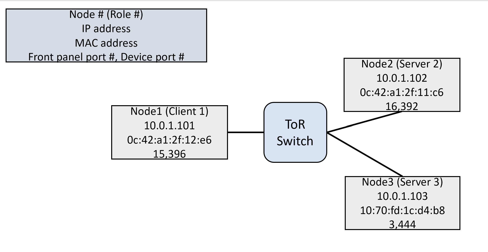

# NetClone

**NetClone: Fast, Scalable, and Dynamic Request Cloning for Microsecond-Scale RPCs**
*ACM SIGCOMM 2023*

NetClone is an in-network dynamic request cloning mechanism for microsecond-scale RPC workloads. The programmable switch dynamically duplicates requests to two idle servers and returns only the faster response, allowing clients to achieve low tail latency even under unexpected server-side latency variability.

This repository contains the artifact for evaluating NetClone, including:

1. **Switch data plane** (`netclone.p4`) — P4 program for Intel Tofino1
2. **Switch control plane** (`controller.py`) — Python controller for table rule configuration
3. **Client and server applications** (`client.c`, `server.c`) — Synthetic RPC workload generators

## Table of Contents

- [Quick Start](#quick-start)
- [Hardware Requirements](#hardware-requirements)
- [Software Requirements](#software-requirements)
- [Installation](#installation)
  - [Client/Server-side](#clientserver-side)
  - [Switch-side](#switch-side)
- [Experiment Workflow](#experiment-workflow)
  - [Switch-side Setup](#switch-side-setup)
  - [Client/Server-side Setup](#clientserver-side-setup)
- [Runtime Accuracy Tuning](#runtime-accuracy-tuning)
- [Citation](#citation)

## Quick Start

For experienced operators who just want the end-to-end flow:

1. **Build.**  Run `make` on every host; compile `netclone.p4` against the SDE on the switch.
2. **Per-node one-time setup.**  Edit and `sudo ./scripts/setup_arp.sh` (static ARP for the data-plane network), then `sudo ./scripts/host_setup.sh` (sysctl + hugepages).
3. **Per-shell setup.**  In every terminal that will launch a binary, run `source scripts/set_memlock_unlimited.sh` (must be `source`, not `bash` — see [System Tuning](#2-system-tuning)).
4. **Switch.**  Start `run_switchd.sh -p netclone`, bring up the data-plane ports, then `python3 controller.py 3 2 0`.
5. **Experiment.**  Start `./server NUM_WORKERS PROTOCOL_ID DIST` on each server host, then `./client NUM_SRV PROTOCOL_ID DIST TIME_EXP TARGET_QPS` on the client host.
6. **Sanity-check the result.**  Read `Packet loss rate` from the client output — keep it under 2 % for steady-state numbers (see [Interpret the Result](#5-interpret-the-result)).

The rest of this document expands each step.

## Hardware Requirements

- **Nodes**: At least 3 (1 client + 2 servers). More nodes are recommended for better cloning benefit.
- **NICs**: Nvidia ConnectX-5 or similar NIC supporting Nvidia VMA for kernel-bypass networking.
  > Experiments can run without VMA-capable NICs, but latency will be higher and throughput lower due to reliance on the legacy network stack.
- **Switch**: Programmable switch with Intel Tofino1 ASIC.

**Tested hardware:**
| Component | Specification |
|-----------|--------------|
| Nodes | 3 (1 client + 2 servers) |
| NIC | Nvidia 100GbE MCX515A-CCAT ConnectX-5 (single-port) |
| Switch | APS BF6064XT with Intel Tofino1 ASIC |

## Software Requirements

### Clients and Servers

| Component | Tested Environment 1 | Tested Environment 2 |
|-----------|----------------------|----------------------|
| OS | Ubuntu 20.04 LTS (kernel 5.15) | Ubuntu 22.04 LTS (kernel 6.5.0) |
| NIC Driver | Mellanox OFED 5.8-1.2.1 LTS | Mellanox OFED 23.10-1.1.9 LTS |
| Compiler | gcc 9.4.0 | gcc 11.4.0 |
| VMA | libvma 9.4.0 | libvma 9.8.40 LTS |

### Switch

- Ubuntu 20.04 LTS (kernel 5.4)
- Python 3.8.10
- Intel P4 Studio SDE 9.7.0 and BSP 9.7.0

## Minimal Working Example

The following diagram illustrates the testbed topology for 1 client + 2 servers:



## Installation

### Client/Server-side

1. Place `client.c`, `server.c`, `header.h`, and `Makefile` in the home directory (e.g., `/home/netclone`).

2. Configure cluster information in `header.h`:

   | Line | Variable | Description |
   |------|----------|-------------|
   | 4 | `interface` | Network interface name |
   | 5 | `NUM_CLI` | Number of clients (used for server ID assignment and LAEDGE) |
   | 6 | `NUM_SRV_LAEDGE` | Number of servers including LAEDGE coordinator (min. 3) |
   | 7 | `src_ip` | Client IP addresses (for LAEDGE) |
   | 8 | `dst_ip` | Server IP addresses (for LAEDGE, NoClone, C-Clone) |

   > **Important:** Each node must have a linearly-increasing IP address (e.g., `10.0.1.101`, `10.0.1.102`, `10.0.1.103`), as the server program assigns server IDs based on the last octet of the IP address.

3. Compile:
   ```bash
   make
   ```

### Switch-side

1. Place `controller.py` and `netclone.p4` in the SDE directory.

2. Configure `netclone.p4`:

   | Line | Variable | Description |
   |------|----------|-------------|
   | 2 | `RECIRC_PORT` | Recirculation port number (e.g., `452` for pipeline 3 on APS BF6064XT) |

3. Configure `controller.py`:

   | Line | Variable | Description |
   |------|----------|-------------|
   | 2 | `RECIRC_PORT` | Recirculation port number |
   | 3 | `ip_list` | IP addresses of nodes |
   | 8 | `port_list` | Physical switch port numbers |
   | 13 | `mac_list` | MAC addresses of nodes |

4. Compile `netclone.p4` using the P4 compiler:
   ```bash
   cmake ${SDE}/p4studio \
     -DCMAKE_INSTALL_PREFIX=${SDE_INSTALL} \
     -DCMAKE_MODULE_PATH=${SDE}/cmake \
     -DP4_NAME=netclone \
     -DP4_PATH=${SDE}/netclone.p4
   make
   make install
   ```
   > `${SDE}` and `${SDE_INSTALL}` are paths to the SDE. For example: `SDE=/home/admin/bf-sde-9.7.0`, `SDE_INSTALL=/home/admin/bf-sde-9.7.0/install`.

   <details>
   <summary>Expected compilation output</summary>

   ```
   --
   P4_LANG: p4-16
   P4C: /home/admin/bf-sde-9.7.0/install/bin/bf-p4c
   P4C-GEN_BRFT-CONF: /home/admin/bf-sde-9.7.0/install/bin/p4c-gen-bfrt-conf
   P4C-MANIFEST-CONFIG: /home/admin/bf-sde-9.7.0/install/bin/p4c-manifest-config
   --
   P4_NAME: netclone
   --
   P4_PATH: /home/admin/bf-sde-9.7.0/netclone.p4
   -- Configuring done
   -- Generating done
   -- Build files have been written to: /home/admin/bf-sde-9.7.0
   [  0%] Built target bf-p4c
   [  0%] Built target driver
   [100%] Generating netclone/tofino/bf-rt.json
   [100%] Built target netclone-tofino
   [100%] Built target netclone
   Install the project...
   -- Install configuration: "RelWithDebInfo"
   ```
   </details>

## Experiment Workflow

### Switch-side Setup

You need **three terminals** for the switch control plane.

**Terminal 1 — Start the switch program:**
```bash
./run_switchd.sh -p netclone
```

<details>
<summary>Expected output</summary>

```
Using SDE /home/admin/bf-sde-9.7.0
Using SDE_INSTALL /home/admin/bf-sde-9.7.0/install
Setting up DMA Memory Pool
...
bf_switchd: server started - listening on port 9999
bfruntime gRPC server started on 0.0.0.0:50052
bfshell> Starting UCLI from bf-shell
```
</details>

**Terminal 2 — Configure ports:**
```bash
./run_bfshell.sh
# In bfshell:
ucli
pm
port-add #/- 100G NONE
port-enb #/-
an-set -/- 2    # Disable auto-negotiation (recommended)
```
> Port configuration requires knowledge of Intel Tofino. Refer to the switch manual for details.

**Terminal 3 — Run the controller:**
```bash
python3 controller.py <total_nodes> <num_servers> <use_racksched>
```

For the minimal working example (3 nodes, 2 servers):
```bash
python3 controller.py 3 2 0
```

### Client/Server-side Setup

We ship a small `scripts/` directory with the three pieces below — the
files are short, idempotent, and meant to be edited per cluster.

#### 1. Network Configuration

The switch does not handle host network setup, so every host that
participates on the data-plane network needs a full ARP table.
Edit the `PEERS` array in [`scripts/setup_arp.sh`](scripts/setup_arp.sh)
so it lists every `(data-plane IP, NIC MAC)` pair in your testbed
(a few example entries from our cluster are kept as a starting
point), then run on every host:
```bash
sudo ./scripts/setup_arp.sh
arp -an   # verify
```
Confirm reachability with `ping` over the data-plane interface
before continuing.

#### 2. System Tuning

**Kernel-bypass tuning (system-wide).**  Sets `net.core.rmem_*`,
`kernel.shmmax`, and the hugepage pool.  These are kernel-level
settings and persist for the rest of the boot, so the script only
needs to run once per node per boot:
```bash
sudo ./scripts/host_setup.sh
```

**Locked-memory limit (per-shell).**  VMA registers huge pages with
the NIC and needs `RLIMIT_MEMLOCK` lifted; the default 64 KiB cap
makes every binary fail at startup.  Run in *every* terminal that
will launch a `client` / `server` binary:
```bash
source scripts/set_memlock_unlimited.sh
```
> ⚠️ **Source it, do not `bash` it.**  `ulimit` is a shell builtin
> and only affects the shell that executes it.  Running
> `bash scripts/set_memlock_unlimited.sh` raises the limit for the
> script's subshell only, so any binary you launch from your
> interactive shell afterwards will still hit the default cap.
> For a permanent cluster-wide fix, add
> `*  -  memlock  unlimited` to `/etc/security/limits.conf` and
> log out / log in once; after that, this step is not needed.

#### 3. Start Servers

```bash
LD_PRELOAD=libvma.so VMA_THREAD_MODE=2 ./server <NUM_WORKERS> <PROTOCOL_ID> <DIST>
```

| Parameter | Description |
|-----------|-------------|
| `NUM_WORKERS` | Number of worker threads |
| `PROTOCOL_ID` | `0` = NoClone, `1` = C-Clone, `2` = LAEDGE, `3` = NetClone |
| `DIST` | Workload distribution: `0` = exponential (25us), `1` = bimodal (25us/250us), etc. (see `server.c` lines 205-208) |

For the minimal working example:
```bash
LD_PRELOAD=libvma.so VMA_THREAD_MODE=2 ./server 1 3 0
```

> **LAEDGE note:** One node must run as coordinator with `PROTOCOL_ID=99`. Minimum 4 nodes required (1 client + 1 coordinator + 2 servers):
> ```bash
> LD_PRELOAD=libvma.so VMA_THREAD_MODE=2 ./server 1 99 0
> ```

#### 4. Start Clients

```bash
LD_PRELOAD=libvma.so VMA_THREAD_MODE=2 ./client <NUM_SRV> <PROTOCOL_ID> <DIST> <TIME_EXP> <TARGET_QPS>
```

| Parameter | Description |
|-----------|-------------|
| `NUM_SRV` | Number of server nodes |
| `PROTOCOL_ID` | Same as server-side |
| `DIST` | Same as server-side (used for log file naming) |
| `TIME_EXP` | Experiment duration in seconds (recommended > 20 due to warm-up) |
| `TARGET_QPS` | Target Tx throughput in RPS (recommended > 5000; values < 2000 may cause accuracy issues) |

For the minimal working example:
```bash
LD_PRELOAD=libvma.so VMA_THREAD_MODE=2 ./client 2 3 0 20 20000
```

<details>
<summary>Expected output</summary>

```
Client 1 is running
Rx Worker 0 is running with Socket 19
Tx Worker 0 is running with Socket 19
Tx Worker 0 done with 400000 reqs, Tx throughput: 19303 RPS
Rx Worker 0 finished with 0 redundant replies
Total time: 20.790212 seconds
Total received pkts: 400000
Rx Throughput: 19239 RPS
Packet loss rate: 0.000000
```
</details>

#### 5. Interpret the Result

When the experiment finishes the client reports Tx / Rx throughput,
total experiment time, and a saturation summary:

```
Total received pkts: 400000
Rx Throughput: 19239 RPS
Packet loss rate: 0.000000
```

`Packet loss rate` is `1 − (received_replies / offered_requests)`,
already expressed as a percentage.  Any non-zero value means the
system has started dropping requests — i.e. it is at or beyond
saturation — so use the loss rate as the saturation indicator and
report peak throughput in one of two equivalent ways:

- **Conservative (loss = 0 %).**  Walk `TARGET_QPS` upward in a
  sweep and report the largest offered rate at which the run still
  finishes with a 0 % loss rate.  The throughput from the *next*
  step in the sweep (the first one to show non-zero loss) is
  saturated and should not be reported.
- **Practical (loss ≤ 2 %).**  Treat any run with loss ≤ 2 % as
  saturated and report its `Rx Throughput` directly.  The small
  residual loss covers end-of-experiment tail effects and minor
  microbursts and does not move the headline number appreciably.

Either convention is fine as long as it is applied consistently
within a comparison.  **Do not report runs with loss > 2 %** — the
system is congested rather than at a steady-state operating point,
so the throughput / latency numbers are not meaningful.  Lower
`TARGET_QPS` and re-run instead.

Per-request latency (in microseconds) is saved as a text file
alongside the binary, with the last line containing the total
experiment time.  A sample log is available at
`log/log-3-1-0-2-15-1-0-5-2000.txt` (captured without VMA).

## Runtime Accuracy Tuning

The server simulates RPC work using a calibrated busy-loop (`server.c`, lines 306-318):

```c
/* Do dummy RPC work */
uint64_t i = 0;
if (rand() / (double) RAND_MAX < probability) run_ns = run_ns * multiple;
do {
    asm volatile ("nop");
    i++;
} while (i / 0.197 < (double) run_ns);
```

This approach is adapted from the [RackSched artifact](https://github.com/netx-repo/RackSched/blob/master/server_code/shinjuku/dp/core/worker.c) (lines 121-125).

The divisor value controls runtime accuracy and **must be calibrated for your environment**:

| Linux Kernel | Calibrated Value |
|-------------|-----------------|
| 5.15 | `0.197` |
| 6.5.0 | `0.64` |

To calibrate, fix the runtime and measure actual execution time:

```c
run_ns = 10000; // Static 10us runtime for calibration
uint64_t start = get_cur_ns();
/* Do dummy RPC work */
uint64_t i = 0;
do {
    asm volatile ("nop");
    i++;
} while (i / 0.197 < (double) run_ns);
printf("%lu\n", (get_cur_ns() - start));
```

If logged latency is unexpectedly high or low, adjust this value accordingly.

## Citation

If you use any part of this artifact in your research, please cite:

```bibtex
@inproceedings{netclone,
    author = {Gyuyeong Kim},
    title = {NetClone: Fast, Scalable, and Dynamic Request Cloning for Microsecond-Scale RPCs},
    booktitle = {Proc. of ACM SIGCOMM},
    year = {2023},
    address = {New York, NY, USA},
    month = sep,
    publisher = {Association for Computing Machinery},
    numpages = {13},
    pages = {195--207},
}
```
